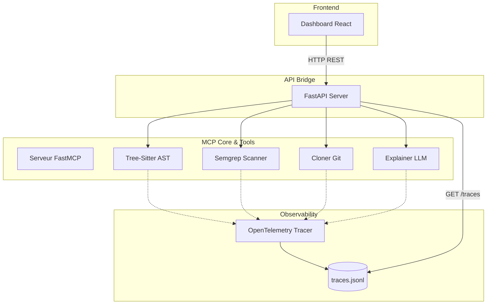

# Analyseur de Dépôts GitHub (MCP + AST + SecOps)

Un outil d'audit "Code-First" intégrant le **Model Context Protocol (MCP)**, l'analyse syntaxique (AST), le scan de sécurité et l'observabilité. Cet outil clone un dépôt, expose des outils d'analyse via un serveur MCP, et les rend accessibles via un bridge FastAPI et un dashboard React.

**Formats d'intégration :** Protocole MCP natif (stdio), API REST (FastAPI bridge), Dashboard React temps réel.

---

## Architecture



---

## How It Works

### 1. Clonage & Exploration
Le système clone un dépôt distant en local et liste son arborescence de manière optimisée (en ignorant les dossiers de build et dépendances). 

### 2. Analyse Syntaxique (AST)
Grâce à `tree-sitter`, le code Python est analysé structurellement. Plutôt que de lire le code comme du texte brut, l'agent identifie les classes, les fonctions et génère un graphe d'appels internes de manière déterministe.

### 3. Explication IA (LLM)
Intégration d'un LLM (OpenAI GPT-4o-mini) pour lire n'importe quel fichier source (SQL, JS, Markdown, etc.) et produire une explication fonctionnelle en langage naturel, affichée en Markdown.

### 4. Scan de Sécurité (Semgrep)
Le dépôt est scanné intégralement par Semgrep via une configuration `auto` pour détecter les vulnérabilités de sécurité et les mauvaises pratiques, indépendamment du langage.

### 5. Observabilité (OpenTelemetry)
Chaque outil MCP est instrumenté. Les durées d'exécution, le succès/échec et le contexte (repo cible, fichier analysé) sont tracés et persistés via un `FileSpanExporter` custom pour ne pas polluer les flux standard du protocole MCP.

---

## Stack

| Couche | Technologie | Usage |
|--------|-------------|-------|
| **Protocole** | FastMCP | Serveur d'outils standardisés |
| **Backend** | Python 3.14 + FastAPI | Bridge REST, exécution des outils |
| **Analyse AST** | Tree-Sitter | Extraction des structures de code |
| **Sécurité** | Semgrep | Scan statique de vulnérabilités |
| **Observabilité** | OpenTelemetry | Tracing, Custom Span Exporter |
| **Dashboard** | React + Vite + TypeScript | Visualisation, arbre de fichiers, télémétrie |
| **LLM** | OpenAI (GPT-4o-mini) | Explication de code cross-language |

---

## Quick Start

```bash
# 1. Installer les dépendances Python
pip install -r requirements.txt

# 2. Configurer la clé API pour l'explication de code
echo "OPENAI_API_KEY=votre_cle" > .env

# 3. Lancer le serveur API (Bridge REST + MCP Tools)
python api_server.py

# 4. Lancer le Dashboard (dans un autre terminal)
cd dashboard
npm install
npm run dev

# 5. Ouvrir http://localhost:5173
```

---

## Ce que ça prouve

### Compétences & Patterns

| Compétence | Comment |
|------------|---------|
| **Model Context Protocol (MCP)** | Création d'un serveur natif exposant 4 outils standards utilisables par n'importe quel client MCP. |
| **Analyse Syntaxique (AST)** | Parsing déterministe au lieu d'expressions régulières fragiles via `tree-sitter`. |
| **Security / DevSecOps** | Intégration programmatique d'un scanner statique (Semgrep) dans une boucle d'analyse. |
| **Observabilité (OpenTelemetry)** | Instrumentation du code, tracing distribué, calcul de métriques (durée, compteurs). |
| **Walking Skeleton** | Validation du cœur MCP en isolation (`client_test.py`) avant l'ajout de l'API et de l'UI. |