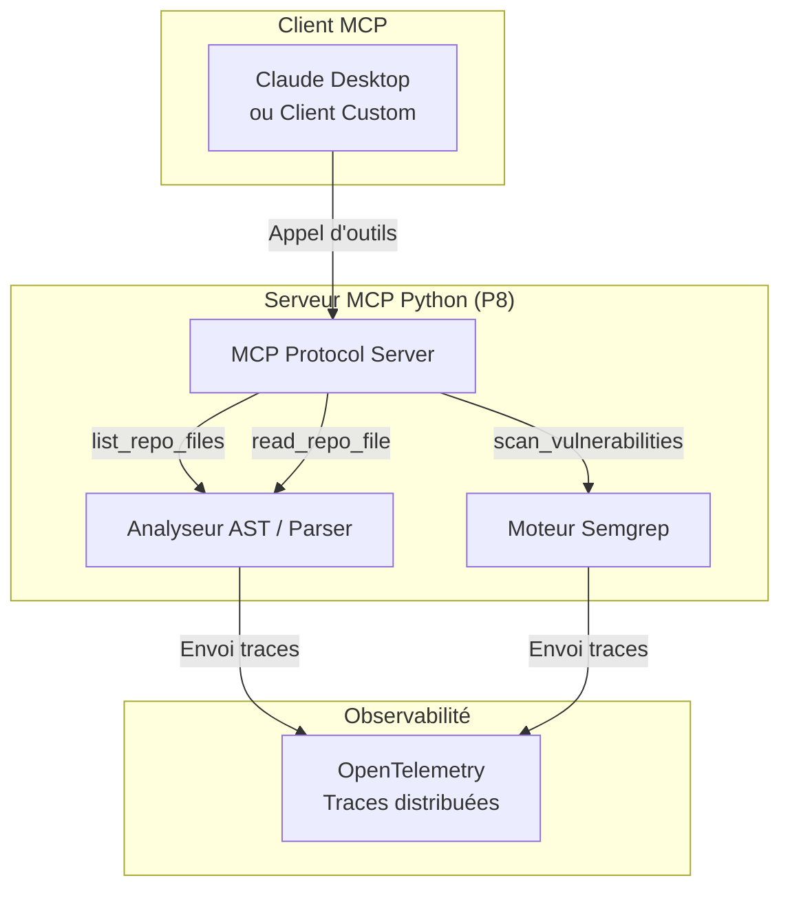

# GitHub Repository Analyzer — Agent d'analyse de code et d'observabilité (MCP)

Un **agent d'analyse de code intelligent** qui se branche sur n'importe quel dépôt GitHub local ou distant, en extrait la structure AST (Abstract Syntax Tree) et les dépendances, et l'analyse via le standard mondial **MCP (Model Context Protocol)**. Instrumenté avec **OpenTelemetry** pour des traces d'exécution en direct, sécurisé avec **Semgrep**, et configurable par **Feature Flags**.

**Formats d'intégration :** Serveur MCP standardisé, CLI.

---

## Architecture



---

## How It Works

### 1. Enregistrement MCP — L'agent s'expose à l'IDE

Le serveur démarre et expose ses outils au protocole MCP standardisé. Tout client compatible (comme Claude Desktop, Cursor ou un script de test) peut instantanément lister et invoquer les capacités d'analyse de l'agent.

### 2. Lecture AST — Compréhension structurelle, pas juste textuelle

Contrairement à un simple parser de texte, l'agent utilise le module syntaxique `ast` de Python pour construire l'arbre de syntaxe abstraite (Abstract Syntax Tree) du code. Cela lui permet d'identifier les classes, les méthodes, les importations réelles et les dépendances entre les fichiers.

### 3. Scan de sécurité automatisé via Semgrep

Avant de formuler des recommandations de refactorisation, l'agent lance un scan local à l'aide de **Semgrep** pour localiser les vulnérabilités de sécurité les plus communes et les failles logiques dans les fichiers du dépôt.

### 4. Observabilité totale via OpenTelemetry

Chaque appel d'outil, chaque parsing de fichier et chaque évaluation d'agent génère des traces standardisées OpenTelemetry. L'architecte peut suivre en temps réel la latence, le cheminement de pensée de l'agent, et repérer les goulets d'étranglement ou les appels LLM redondants.

---

## Stack technique

| Couche | Technologie | Usage |
|--------|-------------|-------|
| **Protocole** | Model Context Protocol (MCP) | Exposition standardisée des outils au LLM |
| **Parsing & AST** | Python `ast` (Abstract Syntax Tree) | Analyse syntaxique et sémantique profonde du code |
| **Sécurité** | Semgrep CLI | Scan automatisé de vulnérabilités et failles de sécurité |
| **Observabilité** | OpenTelemetry (Otel) | Traces distribuées et mesures de performances de l'agent |
| **Gouvernance** | Feature Flags (Custom) | Activation/désactivation de modules d'analyse et switch de modèles à chaud |
| **Développement** | Python 3.12+ | Langage du serveur et des briques de parsing |

---

## Quick Start

```bash
# 1. Installer les dépendances
pip install -r requirements.txt

# 2. Lancer le serveur MCP en local
python server.py

# 3. Lancer le client de test pour valider le Walking Skeleton
python client_test.py
```

---

## Ce que ça prouve

### Compétences d'Architecte Agent

| Compétence | Comment |
|------------|---------|
| **Standard MCP** | Intégration de l'agent dans l'écosystème mondial MCP, rendant l'agent utilisable par n'importe quel IDE ou client compatible. |
| **Analyse syntaxique (AST)** | Extraction de la logique structurelle du code sans dépendre de simples regex ou de parsing de texte approximatif. |
| **Observabilité distribuée** | Instrumentation standardisée (OpenTelemetry) pour auditer la performance et la pensée de l'agent en production. |
| **Sécurité par design (Semgrep)** | Utilisation de Semgrep pour s'assurer que l'agent ne propose pas de refactorisations introduisant des failles de sécurité. |
| **Gouvernance dynamique** | Configuration à chaud du comportement de l'agent via des Feature Flags. |
