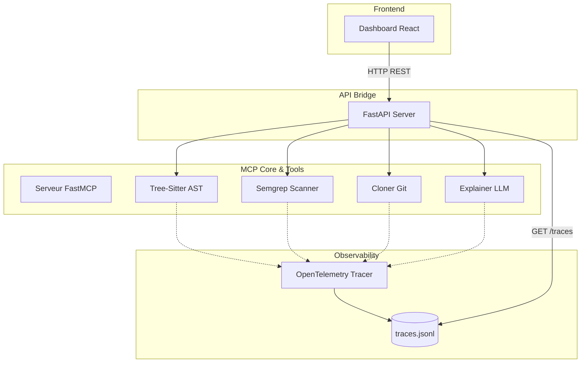

# Analyseur de Dépôts GitHub (MCP + AST + SecOps)

> **Formats d'intégration :** Protocole MCP natif (stdio), API REST (FastAPI bridge), Dashboard React temps réel.

Un outil d'audit "Code-First" intégrant le **Model Context Protocol (MCP)**, l'analyse syntaxique (AST), le scan de sécurité et l'observabilité. Cet outil clone un dépôt, expose des outils d'analyse via un serveur MCP, et les rend accessibles via un bridge FastAPI et un dashboard React.

---

## Le Problème

Les audits de code "boîte noire" prennent un temps infini, reposent souvent sur des documentations obsolètes et ignorent les vulnérabilités cachées. Les LLMs manquent de structure pour analyser une base de code entière sans contexte, et l'intégration de multiples outils d'analyse statique dans un flux automatisé est complexe et fragmentée.

## La Solution

Un outil d'audit "Code-First" qui combine l'analyse déterministe (AST via Tree-Sitter, Sécurité via Semgrep) et l'explication IA (LLM). L'ensemble des capacités est exposé nativement via le standard industriel Model Context Protocol (MCP) permettant à n'importe quel client MCP de l'exploiter. Un bridge FastAPI et un dashboard React sont ajoutés pour rendre le système testable et visuel instantanément. L'observabilité est garantie par OpenTelemetry.

---

## Ce que ça prouve

| Compétence | Comment |
|------------|---------|
| **Model Context Protocol (MCP)** | Création d'un serveur natif exposant 4 outils standards utilisables par n'importe quel client MCP. |
| **Analyse Syntaxique (AST)** | Parsing déterministe au lieu d'expressions régulières fragiles via `tree-sitter`. |
| **Security / DevSecOps** | Intégration programmatique d'un scanner statique (Semgrep) dans une boucle d'analyse. |
| **Observabilité (OpenTelemetry)** | Instrumentation du code, tracing distribué, calcul de métriques (durée, compteurs) avec un FileSpanExporter custom. |
| **Architecture Découplée** | Le cœur MCP fonctionne en isolation, le bridge FastAPI le rend accessible au web, le Dashboard React le rend visuel. |

---

## Stack

- **Protocole** : FastMCP
- **Backend** : Python 3.14 + FastAPI
- **Analyse AST** : Tree-Sitter
- **Sécurité** : Semgrep
- **Observabilité** : OpenTelemetry
- **LLM** : OpenAI (GPT-4o-mini)
- **Frontend** : React 19 + Vite + TypeScript

---

## Architecture

